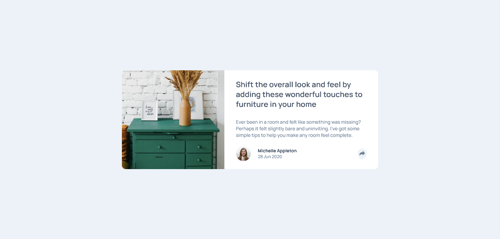

# Frontend Mentor - Article preview component solution

This is a solution to the [Article preview component challenge on Frontend Mentor](https://www.frontendmentor.io/challenges/article-preview-component-dYBN_pYFT). Frontend Mentor challenges help you improve your coding skills by building realistic projects. 

## Table of contents

- [Overview](#overview)
  - [The challenge](#the-challenge)
  - [Screenshot](#screenshot)
  - [Links](#links)
- [My process](#my-process)
  - [Built with](#built-with)
  - [What I learned](#what-i-learned)
  - [Useful resources](#useful-resources)
- [Author](#author)

## Overview

### The challenge

Users should be able to:

- View the optimal layout for the component depending on their device's screen size
- See the social media share links when they click the share icon

### Screenshot




### Links

- Solution URL: [article-preview-component-master](https://github.com/saulgutierrez/article-preview-component-master)
- Live Site URL: [article-preview-component-master](https://stirring-baklava-4958cb.netlify.app/)

## My process

### Built with

- Semantic HTML5 markup
- CSS custom properties
- Flexbox

### What I learned

Transform and z-index properties, and absolute position:

```css
.proud-of-this-css {
  position: absolute;
  transform: rotate(45deg);
  z-index: 1000;
}
```

### Useful resources

- [W3Schools](https://www.w3schools.com/default.asp) - This helped me how to use absolute position and transform property.

## Author

- Website - [Saúl Gutiérrez](https://sauladai.netlify.app/)
- Frontend Mentor - [@saulgutierrez](https://www.frontendmentor.io/profile/saulgutierrez)